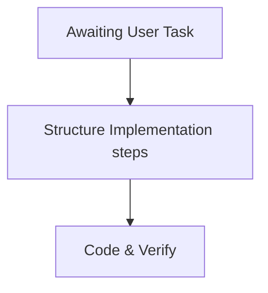

# 📋 Work Plan & Status Log (Plan Mode)

We have successfully resolved the previous migration, timeout, and styling challenges. This document serves as the master plan for the next tasks you assign.

---

## 🚦 Current Status Summary

| System / Component | Status | Action Taken |
| :--- | :--- | :--- |
| **AeroForm Suite Backend** (Port `5000`) | 🟢 **Online & Responsive** | Serves APIs and database. DB connection resolved. |
| **Smart-Office Noting Engine** (Port `5001`) | 🟢 **Online & Responsive** | Running on Anaconda python. Emojis crash fixed. |
| **Unified Portal** (Port `8080`) | 🟢 **Online & Responsive** | Unified entrance page. |
| **Dark Theme Styling** | 🟢 **Fixed (Compiled)** | MUI text visibility and Chrome Autofill bugs resolved; built successfully. |
| **Windows Inbound Firewall** | ⚠️ **Rule Needed on LAN** | Firewall rules should be active to allow client machine traffic. |

---

## 🗓️ Next Steps & Tasks

> [!NOTE]
> I am currently in **Plan Mode** and ready to receive your next instructions. Once you assign the task, I will populate the detailed breakdown below.

